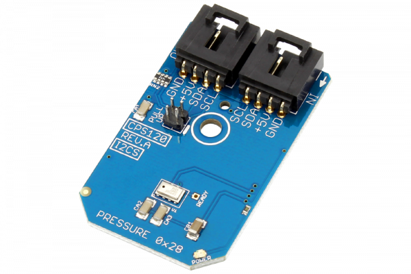

[](https://store.ncd.io/product/cps120-digital-barometer-altimeter-i2c-mini-module/).

# CPS120

The CPS120 is a high-quality, low-cost capacitive absolute pressure sensor solution with a compensated digital pressure and temperature output for low pressure applications, such as barometric sensing.
This Device is available from www.ncd.io

[SKU: CPS120]

(https://store.ncd.io/product/cps120-digital-barometer-altimeter-i2c-mini-module/)
This Sample code can be used with Raspberry Pi.

Hardware needed to interface CPS120 barometer sensor With Raspberry Pi :

1. <a href="https://store.ncd.io/product/cps120-digital-barometer-altimeter-i2c-mini-module/">CPS120 barometer altimeter Sensor</a>

2. <a href="https://store.ncd.io/product/i2c-shield-for-raspberry-pi-3-pi2-with-outward-facing-i2c-port-terminates-over-hdmi-port/">Raspberry Pi I2C Shield</a>

3. <a href="https://store.ncd.io/product/i%C2%B2c-cable/">I2C Cable</a>

## Python

Download and install smbus library on Raspberry pi. Steps to install smbus are provided at:

https://pypi.python.org/pypi/smbus-cffi/0.5.1

Download (or git pull) the code in pi. Run the program.

```cpp
$> python CPS120.py
```
The lib is a sample library, you will need to calibrate the sensor according to your application requirement.
